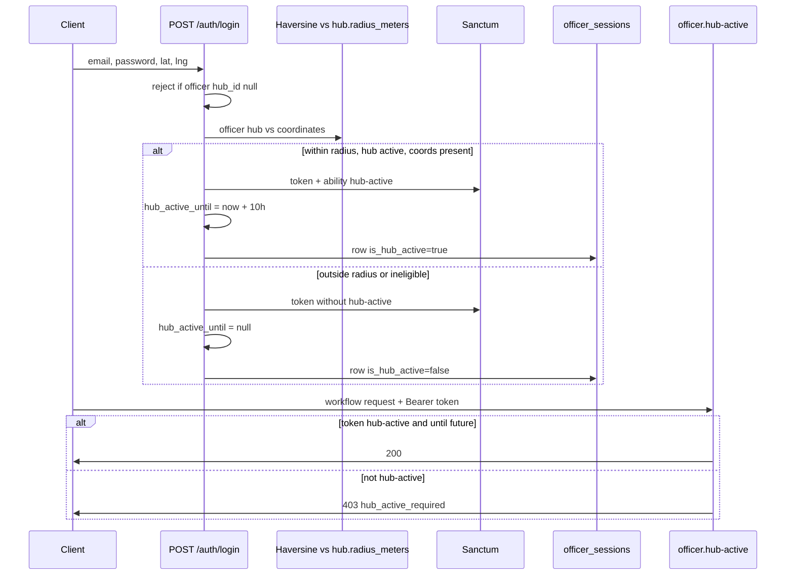

# Plan: Officer Hub-Active Login and Graduated Access

> **Superseded:** Shift semantics (shared shift model, decision #6) are defined in [`officer-shared-shift-fixes.md`](./officer-shared-shift-fixes.md). This document remains for historical context on the original per-token design.

## Summary

Officers authenticate through the shared `POST /api/auth/login` endpoint (Laravel Sanctum personal access tokens). This plan adds **geolocation-aware login** for officers: when they log in within the **per-hub radius** (default **100 m**) of their **assigned, active hub**, they receive a **hub-active** session that unlocks operational workflows for **10 hours**. Outside that radius, login still succeeds but workflows are blocked — only **profile/auth** and **reference read** routes remain available until they log in again from their hub.

Enforcement uses **Sanctum token abilities** (`hub-active`) plus an **officer-level `hub_active_until` timestamp** (denormalized session state for revocation and expiry). A new **`officer.hub-active` middleware** mirrors the existing `actor.active` whitelist pattern from `backend-auth-config-hardening.md`. **Officer disable** and **logout** revoke hub-active state and tokens as required.

Each officer login creates an **`officer_sessions` row** (audit/shift tracking) linked to the Sanctum token. **Active managers** may list sessions via `GET /api/officer-sessions` (read-only).

Users and managers are **unchanged** — no geolocation on login, no graduated access.

**Hard constraint:** No files under `apps/backend/tests/` may be created, modified, or deleted in any phase.

**Related prior work:** `hub-enable-disable.md` (hub `is_active`), `backend-officers-issues-districts-capabilities.md` (officer list, disable/enable, issue visibility), `backend-auth-config-hardening.md` (`actor.active` whitelist, 7-day Sanctum expiry, logout revokes all tokens).

---

## Resolved Decisions

| # | Topic | Decision |
|---|-------|----------|
| 1 | Officer coordinates on login | **Required.** Officers must send `latitude` and `longitude` on `POST /api/auth/login`. Missing or invalid coords → `422`. Users/managers ignore these fields. |
| 2 | Officer without `hub_id` | **Block login.** `POST /api/auth/login` returns `403` with `code: hub_not_assigned` when the resolved officer has no assigned hub. Officer must have hub assigned by a manager before logging in. |
| 3 | Inactive hub or missing hub coordinates | **Treat as outside-radius.** Login succeeds; token issued **without** `hub-active`; workflows blocked. Do not reject login entirely. |
| 4 | Hub radius | **Per-hub `radius_meters` column** on `hubs`, default **100**. Main managers set it on hub create/update (`StoreHubRequest`, `UpdateHubRequest`). Remove global-only radius config; keep `hub_active_ttl_hours` in `config/officer.php`. |
| 5 | Non-hub-active token lifetime | **Keep global 7-day** Sanctum expiry for all officer tokens. |
| 6 | Multi-device | **Independent tokens.** Device A keeps its hub-active session when device B logs in outside radius. Each token has its own `hub-active` ability; `hub_active_until` on the officer row reflects the **current** token's session (see Multi-device note below). |
| 7 | `officer_sessions` | **Wire up now.** Auto-created on every officer login; `GET /api/officer-sessions` for **any active manager** (main or ordinary). No create/update/delete API. |
| 8 | Officer registration | **Non-hub-active until hub-radius login.** `POST /api/auth/register/officer` runs the same geo evaluation on the auto-issued token. Registration requires `latitude`/`longitude`. If within hub radius → hub-active; else standard token. Registration does not require `hub_id` today; officer cannot use `POST /api/auth/login` until a manager assigns a hub (decision #2). |
| 9 | Response shape | **`hub_active` and `hub_active_until` on login wrapper, `GET /api/auth/me` wrapper, and inside officer `profile`** (via `AuthProfileResource`). |
| 10 | Workflow denial `403` format | **Option B — `message` + `code`.** Stable machine-readable codes alongside human-readable messages. Document all codes in OpenAPI. |
| 11 | Re-login within 10 h from hub | **No extension.** A new hub-radius login while an unexpired session exists does **not** push `hub_active_until` forward; issue a fresh 10 h window from `now()` only for the **new** token (or keep existing until natural expiry for the old token — see Multi-device note). |
| 12 | GPS trust model | **Client-reported coordinates only (v1).** No server verification or continuous geofence. Document limitations in README and OpenAPI. |

---

## Error code contract (decision #10)

Hub-related `403` responses use **`message` + `code`** (not `abort()` string-only). Implement via `response()->json([...], 403)` in middleware and controllers.

| Code | HTTP | When | Example `message` |
|------|------|------|---------------------|
| `hub_active_required` | 403 | Authenticated officer on Tier C route without valid hub-active token (outside-radius login, expired 10 h window, or token lacks `hub-active` ability) | Hub-active session required. |
| `hub_not_assigned` | 403 | Officer resolved on login but `hub_id` is null | Officer hub assignment required before login. |

- `message` is for logs and debug; mobile clients branch on `code`.
- Do not add session hints (`hub_id`, `hub_active_until`) to error bodies — clients read those from `GET /api/auth/me` / profile (decision #9).
- Reserve the `hub_*` prefix for future codes (e.g. `hub_inactive` if ever needed on login).

---

## GPS trust model (decision #12)

**v1:** Officer app sends device GPS on login/registration; server runs Haversine against hub coordinates and `radius_meters`. No mock-location detection, no background geofence, no re-check per request.

| Aspect | v1 behavior |
|--------|-------------|
| Spoofing | Possible via mock-location apps; hub-active is operational policy, not cryptographic proof |
| Accuracy | Consumer GPS ±5–20 m; default 100 m radius absorbs noise; per-hub `radius_meters` adjustable |
| Audit | Login coords on `officer_sessions` (`start_lat`, `start_lng`, `distance_meters_at_login`) |
| Walk-away | Workflows stay enabled until 10 h or logout after hub login |

Document limitations in `apps/backend/README.md` and OpenAPI. Future: re-validate on sensitive mutations, jump detection (out of scope).

---

## Multi-device note (decision #6)

Because tokens are independent:

- Token A (hub-active) and Token B (non-hub-active) may coexist.
- **`officers.hub_active_until`** is updated on each login to reflect **that login’s** hub-active outcome. It is **not** a global “any device is hub-active” flag. Middleware must check **the current bearer token’s** `hub-active` ability **and** (when hub-active) that `hub_active_until` is still in the future.
- For `GET /auth/me` / profile `hub_active`: derive from **current token** ability + `hub_active_until` + officer `is_active`, not from officer row alone.
- Re-login from hub (decision #11): new hub-active token gets `hub_active_until = now() + 10h`; old token’s ability remains until its own expiry/revocation but officer row `hub_active_until` reflects the latest hub-active login (middleware still gates per-token).

---

## Proposed Design

### Data model

| Change | Detail |
|--------|--------|
| **`hubs.radius_meters`** | `unsignedSmallInteger`, default **100**, not null. Validated on create/update (e.g. `integer`, `min:10`, `max:5000`). Exposed in hub API resources. |
| **`officers.hub_active_until`** | `datetime`, nullable. Set on hub-radius login; cleared on outside-radius login, logout, disable. Updated per login (no extension — decision #11). |
| **Sanctum token** | Hub-radius login: `createToken('api-login', ['hub-active'])`. Outside-radius: `createToken('api-login')` without ability. Global 7-day `expires_at` from Sanctum config. **10 h workflow access** enforced via `hub_active_until` + middleware, not token TTL. |
| **`officer_sessions`** | Extend existing table (see below). One row per officer login. |

**`officer_sessions` schema (modify migration `2026_06_01_000018`)**

| Column | Type | Notes |
|--------|------|-------|
| `id` | bigint PK | unchanged |
| `officer_id` | FK officers | unchanged |
| `personal_access_token_id` | FK `personal_access_tokens`, nullable, unique | Links session to Sanctum token; null if token already deleted |
| `hub_id` | FK hubs, nullable | Officer’s assigned hub at login time |
| `shift_start` | datetime | Login time (default now) |
| `shift_end` | datetime, nullable | Set on logout, disable, or when session superseded |
| `start_lat` / `start_lng` | decimal, nullable | Login coordinates |
| `distance_meters_at_login` | unsignedInteger, nullable | Haversine result; null if coords/hub missing |
| `is_hub_active` | boolean, default false | Whether this login was within radius with eligible hub |
| `hub_active_until` | datetime, nullable | Copy of officer session expiry for this login |
| `last_lat` / `last_lng` / `last_seen_at` | keep nullable | Reserved for future location pings; unused in v1 |
| `is_active` | boolean, default true | false when shift ended |

Remove reliance on `last_*` in v1 unless a simple “touch on login only” is desired — columns stay for forward compatibility.

**Why both ability and column?**

- **Ability** (`hub-active`): per bearer token — supports multi-device (decision #6).
- **`hub_active_until`**: officer-level timestamp for profile/`me` and expiry hygiene; middleware checks both for hub-active tokens.

### Token lifecycle



| Event | Token behavior | Officer `hub_active_until` | `officer_sessions` |
|-------|----------------|----------------------------|---------------------|
| Hub-radius login | New token with `hub-active` | Set to now + 10h (no extension) | New row, `is_hub_active=true` |
| Outside-radius login | New token, no ability | `null` | New row, `is_hub_active=false` |
| Login without `hub_id` | **Blocked** — no token | — | No row |
| Logout | **All** tokens deleted (existing) | `null` | Close all open rows (`shift_end`, `is_active=false`) |
| Officer disable | **All** tokens deleted | `null` | Close all open rows |
| 10 h elapsed | Token may still be valid (7 d) | Past → middleware denies Tier C | Row unchanged; `is_active` false on logout only |
| Officer enable | No auto hub-active | Unchanged until hub login | — |

**Users / managers:** unchanged `createToken('api-login')`.

### Geolocation

- **Input:** `latitude` and `longitude` **required** for officers on login and registration (`required`, `numeric`, `between` rules). Optional/ignored for users and managers.
- **Algorithm:** Haversine distance in meters vs `hubs.latitude` / `hubs.longitude`.
- **Helper:** `App\Support\Geo\Haversine::distanceMeters(...)`.
- **Threshold:** `distance <= $hub->radius_meters`.
- **Preconditions for hub-active:** officer `hub_id` not null; hub exists; hub `is_active === true`; hub coordinates present.

Extract evaluation to `App\Actions\Auth\EvaluateOfficerHubLogin` returning an enum/DTO: `HubActiveEligible`, `OutsideRadius`, `InactiveHub`, `MissingCoordinates`, `MissingLoginCoordinates` (should not occur if validation passes).

Shared login/session issuance: `App\Actions\Auth\IssueOfficerAuthToken` (or inline in controllers) used by **LoginController** and **RegisterOfficerController**.

### Route classification

**Tier A — Always allowed for authenticated active officers** (no `officer.hub-active`):

| Route | Name |
|-------|------|
| `GET /api/auth/me` | `auth.me` |
| `PATCH /api/auth/me` | `auth.me.update` |
| `POST /api/auth/logout` | `auth.logout` |
| `PATCH /api/auth/me/districts` | `auth.me.districts.update` |

**Tier B — Reference reads:**

| Route | Name |
|-------|------|
| `GET /api/hubs`, `GET /api/hubs/{hub}` | `hubs.index`, `hubs.show` |
| `GET /api/districts`, `GET /api/districts/{district}` | `districts.index`, `districts.show` |
| `GET /api/departments`, `GET /api/departments/{department}` | `departments.index`, `departments.show` |
| `GET /api/categories`, `GET /api/categories/{category}` | `categories.index`, `categories.show` |

**Tier C — Workflows** (require hub-active for officers):

| Route | Name |
|-------|------|
| `GET /api/officers` | `officers.index` |
| `GET /api/issues` | `issues.index` |
| `GET /api/issues/{issue}` | `issues.show` |
| `PATCH /api/issues/{issue}/visibility` | `issues.visibility.update` |
| `GET /api/issues/{issue}/attachments/{attachment}/download` | `issues.attachments.download` |

**Tier D — Manager-only (new):**

| Route | Name |
|-------|------|
| `GET /api/officer-sessions` | `officer-sessions.index` |

Authorization: any **active** `Manager` (`is_active=true`). Users and officers → `403`.

**Enforcement:** Middleware `EnsureOfficerHubActive` (alias `officer.hub-active`):

1. Not `Officer` → pass through.
2. Route in Tier A or B whitelist → pass through.
3. Current token `can('hub-active')` **and** `hub_active_until` is future **and** officer `is_active` → pass through.
4. Else → `403` with `message` + `code: hub_active_required`.

Register in `bootstrap/app.php`; apply after `actor.active` on protected group.

### Login / auth response

Officers — wrapper **and** profile:

```json
{
  "token_type": "Bearer",
  "access_token": "...",
  "actor_type": "officer",
  "hub_active": true,
  "hub_active_until": "2026-06-08T22:00:00+00:00",
  "profile": {
    "id": 1,
    "username": "...",
    "hub_active": true,
    "hub_active_until": "2026-06-08T22:00:00+00:00",
    ...
  }
}
```

- `hub_active`: current token has `hub-active` ability **and** `hub_active_until > now()`.
- Omit or `null` for users/managers.

Login without hub (`hub_id` null):

```json
{
  "message": "Officer hub assignment required before login.",
  "code": "hub_not_assigned"
}
```

---

## Phase 1: Schema, Config, and Geo Helper
**Agent:** dev
**Files:**
- `apps/backend/database/migrations/2026_06_05_000001_create_hubs_table.php` (modify — add `radius_meters`)
- `apps/backend/database/migrations/2026_06_01_000003_create_officers_table.php` (modify — add `hub_active_until`)
- `apps/backend/database/migrations/2026_06_01_000018_create_officer_sessions_table.php` (modify — extend columns)
- `apps/backend/app/Models/Hub.php` (modify)
- `apps/backend/app/Models/Officer.php` (modify)
- `apps/backend/app/Models/OfficerSession.php` (create)
- `apps/backend/config/officer.php` (create — TTL only)
- `apps/backend/.env.example` (modify)
- `apps/backend/app/Support/Geo/Haversine.php` (create)
- `apps/backend/database/seeders/HubSeeder.php` (modify — set `radius_meters` default 100)

### Steps
1. Add `radius_meters` to hubs migration: `unsignedSmallInteger('radius_meters')->default(100)`.
2. Add `hub_active_until` to officers migration.
3. Extend `officer_sessions`: `personal_access_token_id`, `hub_id`, `distance_meters_at_login`, `is_hub_active`, `hub_active_until`; FKs with appropriate `nullOnDelete` on token.
4. Create `OfficerSession` model with relationships (`officer`, `hub`, `personalAccessToken`).
5. `config/officer.php`: `hub_active_ttl_hours` default 10 via `OFFICER_HUB_ACTIVE_TTL_HOURS`.
6. Implement `Haversine::distanceMeters()`.

### Acceptance Criteria
- Fresh migrations include all columns.
- Hub model casts/fillable includes `radius_meters`.
- Officer `hub_active_until` not mass-assignable from requests.

---

## Phase 2: Hub Radius on Main-Manager Hub API
**Agent:** dev
**Files:**
- `apps/backend/app/Http/Requests/Hubs/StoreHubRequest.php` (modify)
- `apps/backend/app/Http/Requests/Hubs/UpdateHubRequest.php` (modify)
- `apps/backend/app/Http/Resources/HubResource.php` (modify)
- `apps/backend/app/Http/Controllers/HubController.php` (modify if needed)

### Steps
1. Validate `radius_meters`: optional on create (default 100), `sometimes` on update; `integer`, `min:10`, `max:5000`.
2. Persist on create/update.
3. Expose in `HubResource`.

### Acceptance Criteria
- Main manager can set per-hub radius; default 100 on create when omitted.

---

## Phase 3: Officer Login and Registration — Geo, Tokens, Sessions
**Agent:** dev
**Files:**
- `apps/backend/app/Http/Requests/Auth/LoginRequest.php` (modify)
- `apps/backend/app/Http/Requests/Auth/RegisterOfficerRequest.php` (modify)
- `apps/backend/app/Actions/Auth/EvaluateOfficerHubLogin.php` (create)
- `apps/backend/app/Actions/Auth/IssueOfficerAuthToken.php` (create)
- `apps/backend/app/Http/Controllers/Auth/LoginController.php` (modify)
- `apps/backend/app/Http/Controllers/Auth/RegisterOfficerController.php` (modify)

### Steps
1. `LoginRequest`: require `latitude`/`longitude` when resolved actor is Officer (validate in controller post-resolve or custom rule after credential check).
2. `RegisterOfficerRequest`: require `latitude`/`longitude`.
3. `EvaluateOfficerHubLogin`: hub `radius_meters`, `is_active`, coords; return eligibility.
4. `IssueOfficerAuthToken`: create Sanctum token with/without `hub-active`; set `hub_active_until`; create `OfficerSession` row with distance and flags; return token + metadata.
5. `LoginController` for officers: if `hub_id` null → `403` with `code: hub_not_assigned`; else run issue action.
6. `RegisterOfficerController`: after create, run same issue action (hub may still be null — registration token without hub-active; officer cannot use login until hub assigned).
7. Add wrapper `hub_active` / `hub_active_until` on login and register responses.

### Acceptance Criteria
- Officer login inside radius → hub-active token, session row, profile fields populated.
- Outside radius → 200, non-hub-active, session row with `is_hub_active=false`.
- No `hub_id` on login → blocked.
- Registration with coords, no hub → 201, non-hub-active token.
- User/manager login unchanged.

---

## Phase 4: Hub-Active Middleware
**Agent:** dev
**Files:**
- `apps/backend/app/Http/Middleware/EnsureOfficerHubActive.php` (create)
- `apps/backend/bootstrap/app.php` (modify)
- `apps/backend/routes/api.php` (modify)

### Steps
1. Whitelist Tier A + B route names.
2. Per-token hub-active check + `hub_active_until`.
3. Clear stale `hub_active_until` when past (officer row only).
4. Register middleware; apply after `actor.active`.
5. Return `403` JSON `{ "message": "...", "code": "hub_active_required" }` — use `response()->json()`, not `abort()`.

### Acceptance Criteria
- Hub-active officer: Tier C works.
- Non-hub-active: Tier A/B work; Tier C `403` with `code: hub_active_required`.
- Managers/users unaffected.

---

## Phase 5: Revocation — Disable, Logout, Session Close
**Agent:** dev
**Files:**
- `apps/backend/app/Http/Controllers/OfficerController.php` (modify)
- `apps/backend/app/Http/Controllers/Auth/LogoutController.php` (modify)
- `apps/backend/app/Actions/Auth/RevokeOfficerHubActive.php` (create)
- `apps/backend/app/Actions/Auth/CloseOfficerSessions.php` (create)

### Steps
1. `RevokeOfficerHubActive`: clear `hub_active_until`, delete all tokens.
2. `CloseOfficerSessions`: set `shift_end`, `is_active=false` on open sessions for officer.
3. Call both from `disable()`.
4. Logout: delete tokens, clear `hub_active_until`, close sessions for officer.
5. `enable()` does not auto-grant hub-active.

### Acceptance Criteria
- Disable revokes tokens, clears hub-active, closes sessions.
- Logout closes sessions for that officer.

---

## Phase 6: Auth Profile, Officer Sessions API
**Agent:** dev
**Files:**
- `apps/backend/app/Http/Controllers/Auth/ProfileController.php` (modify)
- `apps/backend/app/Http/Resources/AuthProfileResource.php` (modify)
- `apps/backend/app/Http/Controllers/OfficerSessionController.php` (create)
- `apps/backend/app/Http/Requests/OfficerSessions/IndexOfficerSessionRequest.php` (create)
- `apps/backend/app/Http/Resources/OfficerSessionResource.php` (create)
- `apps/backend/routes/api.php` (modify)

### Steps
1. `GET /api/auth/me`: officer wrapper + profile `hub_active` / `hub_active_until` from current token.
2. `AuthProfileResource`: add hub-active fields for officers only.
3. `IndexOfficerSessionRequest`: authorize active `Manager` only.
4. `OfficerSessionController@index`: paginated list, eager-load `officer`, `hub`; optional filters `officer_id`, `hub_id`, `is_hub_active` (query params).
5. Route name `officer-sessions.index`.

### Acceptance Criteria
- `me` and profile reflect current token hub-active state.
- Active managers can list sessions; officers/users cannot.

---

## Phase 7: Documentation
**Agent:** writer
**Files:**
- `docs/DBML.txt`
- `docs/openapi.yaml`
- `docs/postman/rauw-backend.postman_collection.json`
- `docs/postman/README.md`
- `apps/backend/README.md`

### Steps
1. **DBML** — `hubs.radius_meters`, `officers.hub_active_until`, full `officer_sessions` columns.
2. **OpenAPI** — login/register coords required for officers; hub-active response fields; error code table (`hub_active_required`, `hub_not_assigned`); `GET /officer-sessions`; hub `radius_meters` on hub schemas.
3. **Postman** — hub login, remote login, workflow 403, manager session list.
4. **README** — decisions summary, GPS trust (#12), env `OFFICER_HUB_ACTIVE_TTL_HOURS`, manual test checklist.

### Acceptance Criteria
- Docs match runtime behavior; GPS trust limitations documented.

---

## Edge Cases

| Scenario | Behavior |
|----------|----------|
| Officer has no `hub_id` | Login **blocked**; registration may succeed with non-hub-active token only |
| Hub missing lat/lng | Cannot grant hub-active; outside-radius path |
| Hub `is_active = false` | Cannot grant hub-active |
| Officer `is_active = false` | `actor.active` whitelist only |
| Distance exactly `radius_meters` | Inclusive (`<=`) |
| GPS spoofing | Accepted v1 risk (see #12) |
| Token valid 7 d, hub-active expired 10 h | Tier A/B OK; Tier C `403` + `hub_active_required` |
| Manager sends lat/lng on login | Ignored |
| Hub radius changed after login | Existing token unchanged until re-login |
| Multiple devices | Independent hub-active tokens |
| Registration then manager assigns hub | Officer must `POST /auth/login` with coords from hub |

---

## Risks and Mitigations

| Risk | Mitigation |
|------|------------|
| Sanctum 7-day expiry vs 10 h workflows | Enforce 10 h via `hub_active_until` + middleware; token may outlive workflow access |
| `hub_active_until` vs per-token ability drift | Set/clear in same transaction as token creation |
| Officer row `hub_active_until` misleading with multi-device | `me`/profile derive from **current** token |
| Whitelist drift | Central constant; doc grep in Phase 7 |
| Registration without hub | Document: assign hub + login from hub for workflows |
| Error `code` drift | Centralize codes in middleware + login controller; document in OpenAPI error code table |

---

## Implementation Order

1. Phase 1 — schema, config, Haversine, models
2. Phase 2 — hub `radius_meters` API
3. Phase 3 — login/register geo, tokens, sessions
4. Phase 4 — middleware
5. Phase 5 — revocation
6. Phase 6 — profile + officer-sessions index
7. Phase 7 — documentation

After approval, invoke `/orchestrator` to execute with commits per phase.
